# Species Catalog

12 species across 4 plant types. Each has a distinct ecological niche — no two species serve the same role.

## Trees (4 species)

### Oak (id: 0)
**The generalist anchor.**

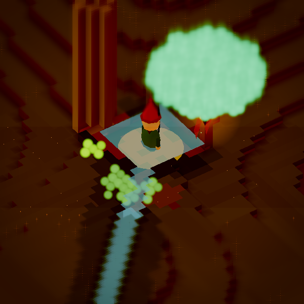 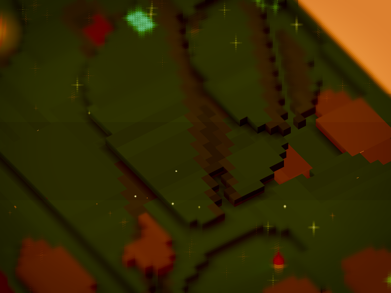 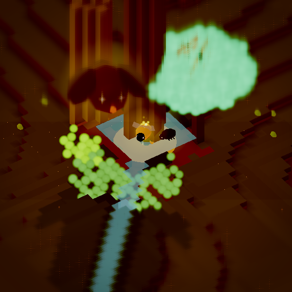 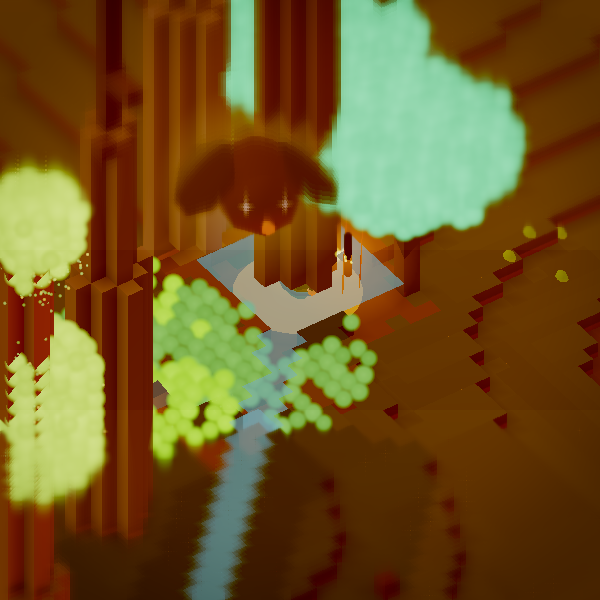 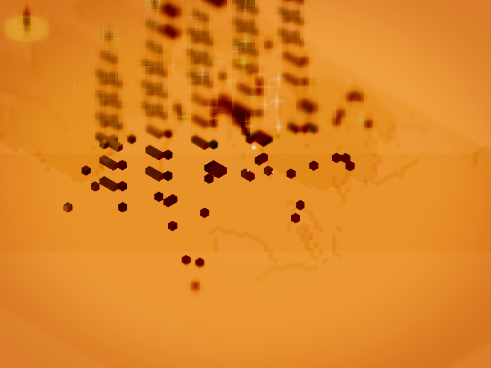

| Parameter | Value | Voxels |
|-----------|-------|--------|
| Max height | 2.5m | 50 |
| Crown radius | 1.2m | 24 |
| Trunk radius | 0.15m | 3 |
| Root depth | 1.5m | 30 |
| Growth rate | 1.0x | baseline |
| Crown shape | Round | |
| Water need | Medium | threshold 60 |
| Shade tolerance | 80/255 | moderate |
| Dispersal | 1.5m / 100 ticks | |

**Niche:** Nitrogen handshake — clover/groundcover near oak roots = 1.5x growth boost. The oak is the species other plants revolve around.

**Discovery:** "Clover near my oak's roots makes it grow faster."

---

### Birch (id: 1)
**The pioneer colonizer.**

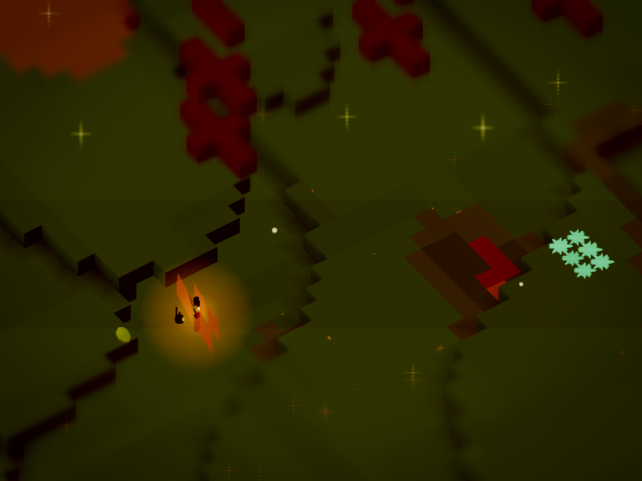 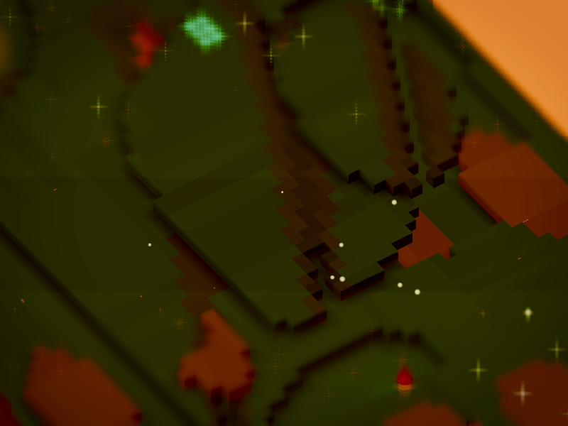 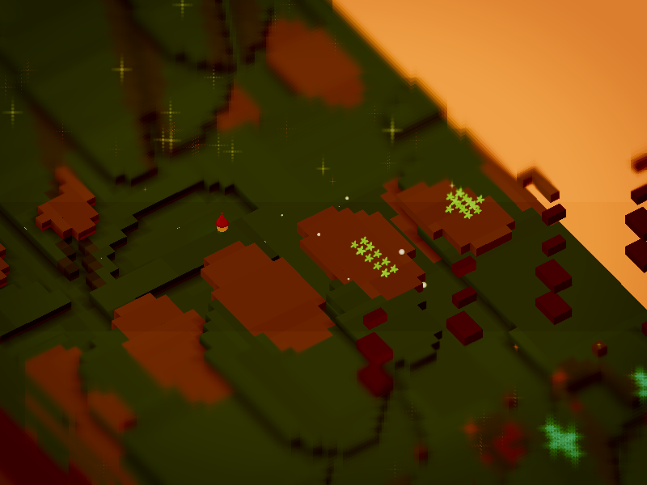 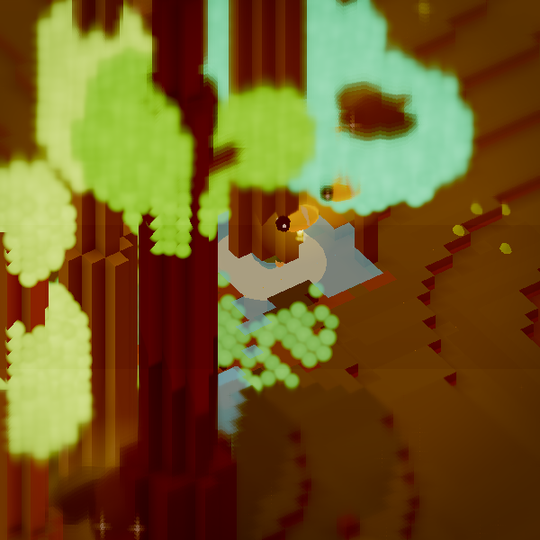

| Parameter | Value | Voxels |
|-----------|-------|--------|
| Max height | 2.0m | 40 |
| Crown radius | 0.8m | 16 |
| Trunk radius | 0.08m | 1-2 |
| Root depth | 1.0m | 20 |
| Growth rate | 1.5x | fast |
| Crown shape | Narrow | slim column |
| Water need | Low | threshold 40 |
| Shade tolerance | 120/255 | shade-tolerant |
| Dispersal | 1.5m / 80 ticks | frequent |

**Niche:** Pioneer vigor — 1.5x growth boost in open ground (no trunks within 8 voxels). First tree to colonize bare patches. Slows once neighbors establish.

**Discovery:** "The birch shot up fast in the clearing, but slowed once the oak grew tall."

---

### Willow (id: 2)
**The water specialist.**

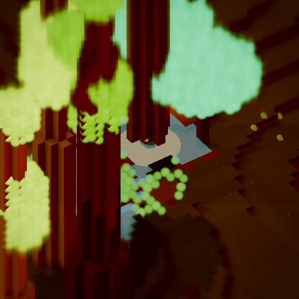 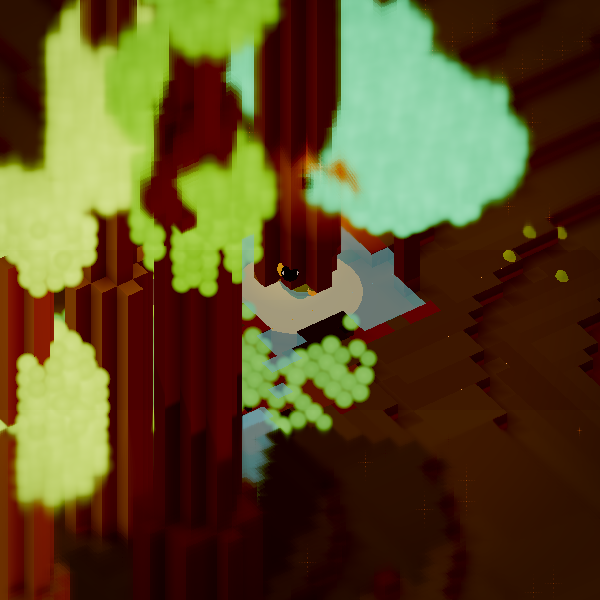 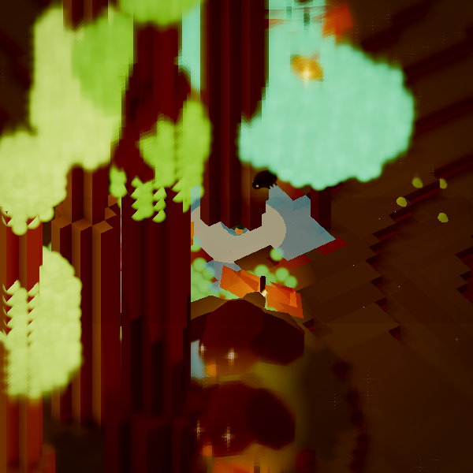 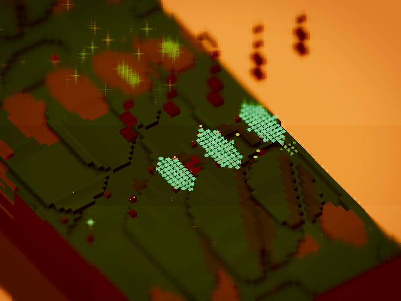

| Parameter | Value | Voxels |
|-----------|-------|--------|
| Max height | 1.8m | 36 |
| Crown radius | 1.5m | 30 |
| Trunk radius | 0.1m | 2 |
| Root depth | 1.2m | 24 |
| Growth rate | 0.8x | slow |
| Crown shape | Wide | drooping |
| Water need | High | threshold 80 |
| Shade tolerance | 60/255 | prefers light |
| Dispersal | 1.0m / 120 ticks | slow, close |

**Niche:** Water affinity — 2.0x growth when roots are well-watered (water_intake > 50). Naturally clusters near springs and streams. Widest crown creates excellent shade canopy.

**Discovery:** "My willow by the stream is growing twice as fast as the one on dry ground."

---

### Pine (id: 3)
**The territorial acidifier.**

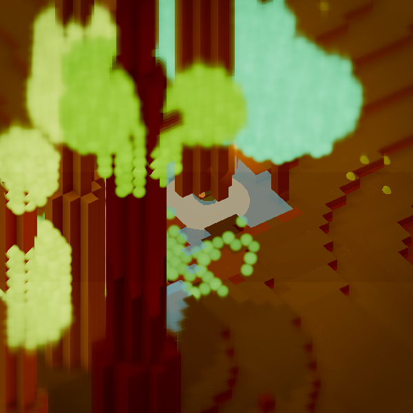  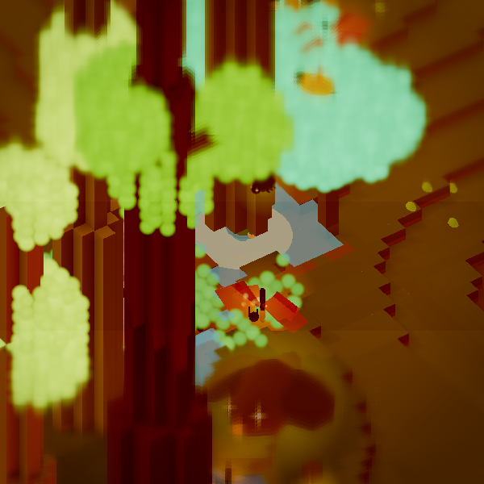 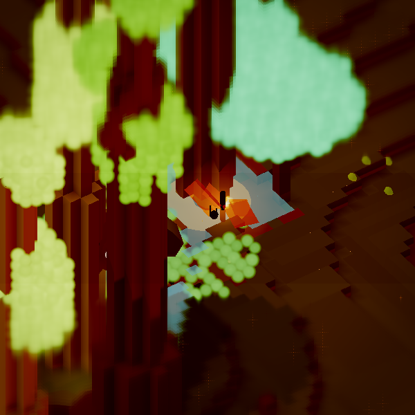

| Parameter | Value | Voxels |
|-----------|-------|--------|
| Max height | 2.8m | 56 |
| Crown radius | 0.8m | 16 |
| Trunk radius | 0.1m | 2 |
| Root depth | 1.5m | 30 |
| Growth rate | 0.7x | slow |
| Crown shape | Conical | narrow, tall |
| Water need | Low | threshold 40 |
| Shade tolerance | 100/255 | moderate |
| Dispersal | 1.5m / 90 ticks | |

**Niche:** Allelopathy — pine roots lower soil pH to <40, halving growth rate of non-tolerant species. Only pine, fern, and moss are acid-tolerant. Creates a "pine zone" where only these species thrive.

**Discovery:** "My seeds won't grow near the pine... the soil is too acidic!"

---

## Shrubs (3 species)

### Fern (id: 4)
**The shade-loving understory.**

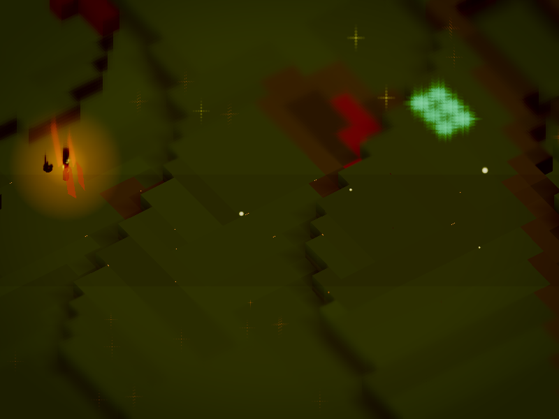 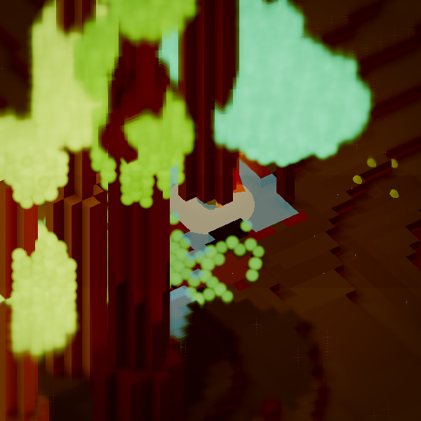 

| Parameter | Value |
|-----------|-------|
| Max height | 0.4m (8 voxels) |
| Crown radius | 0.3m (6 voxels) |
| Growth rate | 1.5x |
| Water need | High |
| Shade tolerance | 30/255 (very tolerant) |

**Niche:** Canopy effect — 1.5x growth in moderate shade (light 5-30). Acid-tolerant. Creates the mid-story in a layered forest: oak canopy > fern > moss.

### Berry Bush (id: 5)
**The bird attractor.**

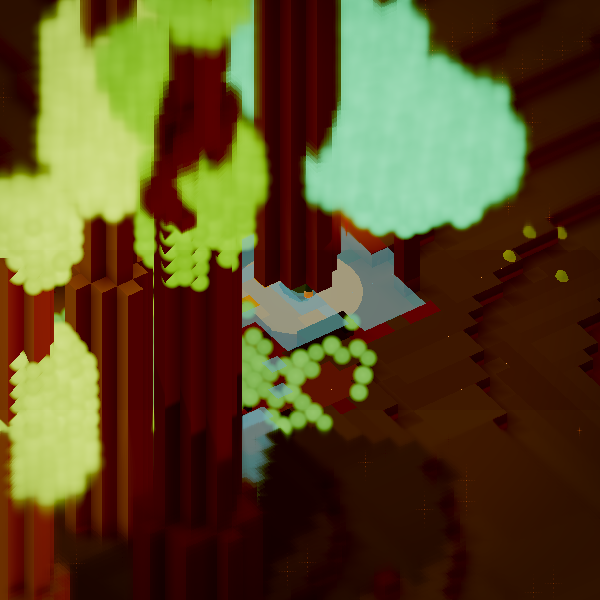 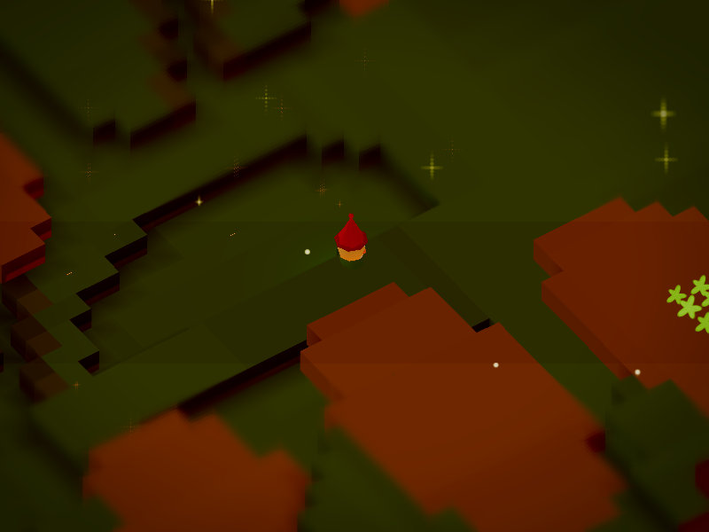 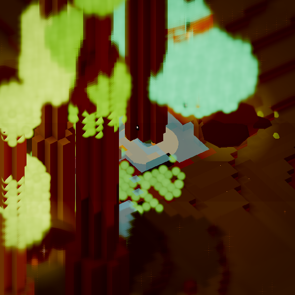

| Parameter | Value |
|-----------|-------|
| Max height | 0.6m (12 voxels) |
| Crown radius | 0.4m (8 voxels) |
| Growth rate | 1.2x |
| Water need | Medium |
| Shade tolerance | 80/255 |

**Niche:** Bird symbiosis — 1.5x growth when birds are within 12 voxels. Birds spread berry bush seeds + fertilize with droppings, creating a self-reinforcing loop.

### Holly (id: 6)
**The tough survivor.**

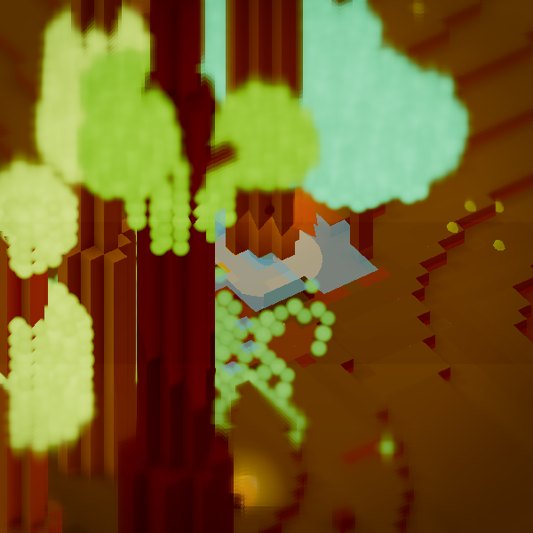 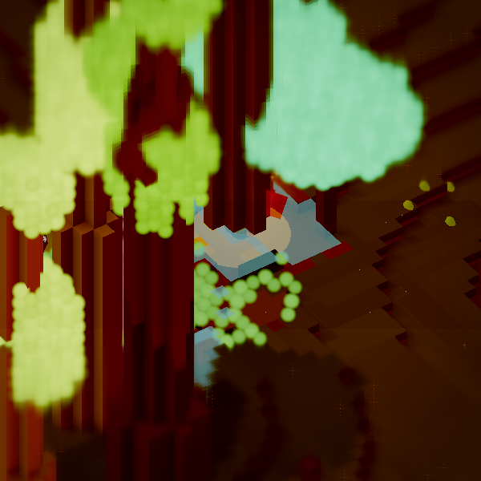 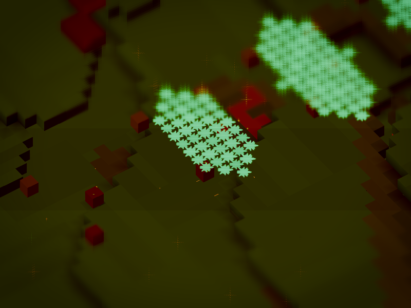

| Parameter | Value |
|-----------|-------|
| Max height | 0.8m (16 voxels) |
| Crown radius | 0.4m (8 voxels) |
| Growth rate | 0.6x |
| Water need | Low |
| Shade tolerance | 40/255 (very tolerant) |

**Niche:** Drought and shade specialist. Slow but resilient — survives conditions that kill other species. No special interaction, but fills the "harsh environment" niche.

---

## Flowers (2 species)

Flowers use a stem + bloom template. The bloom is a **disc of leaf voxels** at the stem top (radius scales with crown_radius — half-size for YoungTree, full for Mature). A small leaf accent sits one voxel above center for 3D shape. This makes flower patches visually prominent for pollinator attraction.

### Wildflower (id: 7)
**The pollinator magnet.**

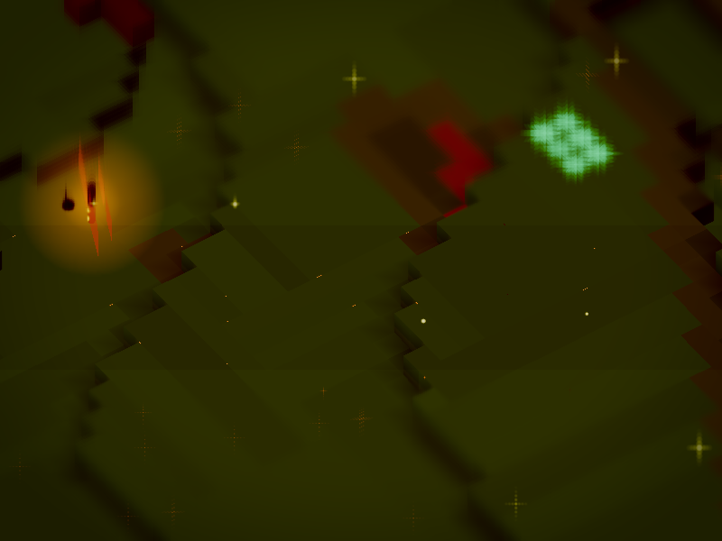  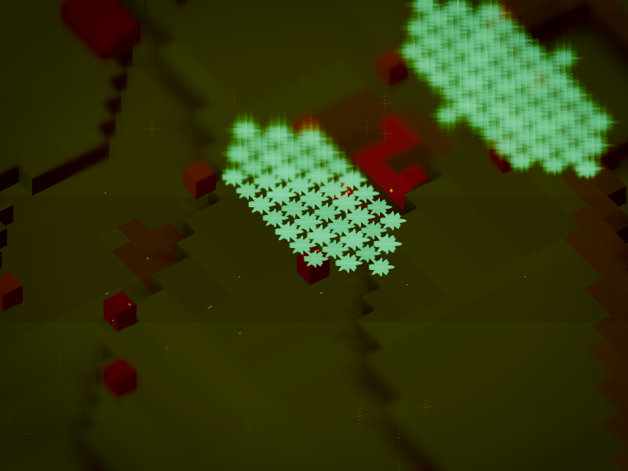

| Parameter | Value |
|-----------|-------|
| Max height | 0.25m (5 voxels) |
| Growth rate | 2.0x |
| Water need | Medium |
| Shade tolerance | 150/255 |
| Dispersal | 0.5m / 40 ticks |

**Niche:** Flower clusters (5+ flower leaves) double pollinator spawn probability and support 5 pollinators (vs 3 normally). Creates visible pollinator "meadows."

### Daisy (id: 8)
**The prolific spreader.**

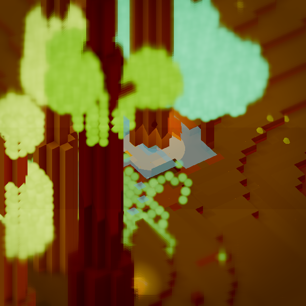 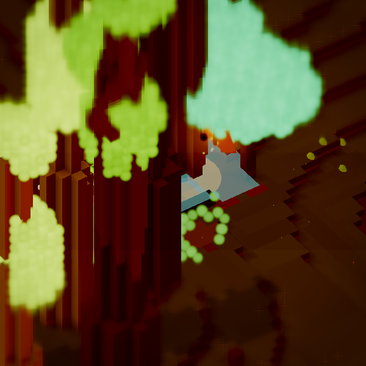 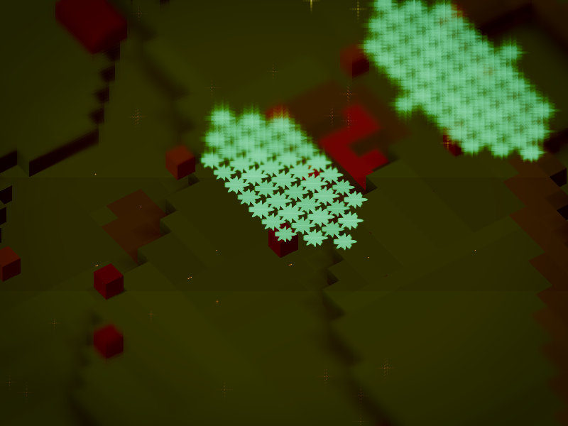

| Parameter | Value |
|-----------|-------|
| Max height | 0.15m (3 voxels) |
| Growth rate | 2.5x (fastest) |
| Water need | Low |
| Shade tolerance | 160/255 |
| Dispersal | 0.4m / 30 ticks |

**Niche:** Rapid ground coverage. Spreads everywhere with minimal resources. No special interaction but carpets clearings quickly.

---

## Groundcover (3 species)

### Moss (id: 9)
**Pioneer species #1.**

 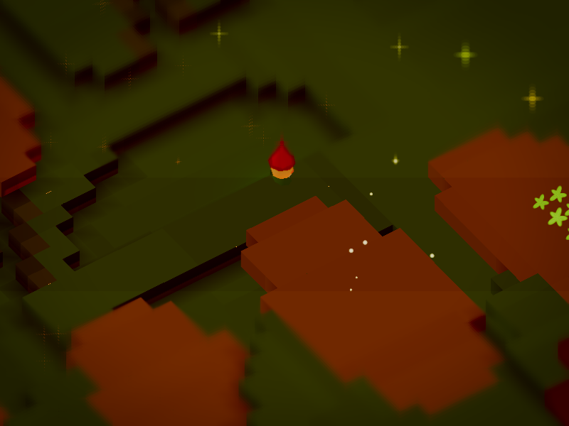 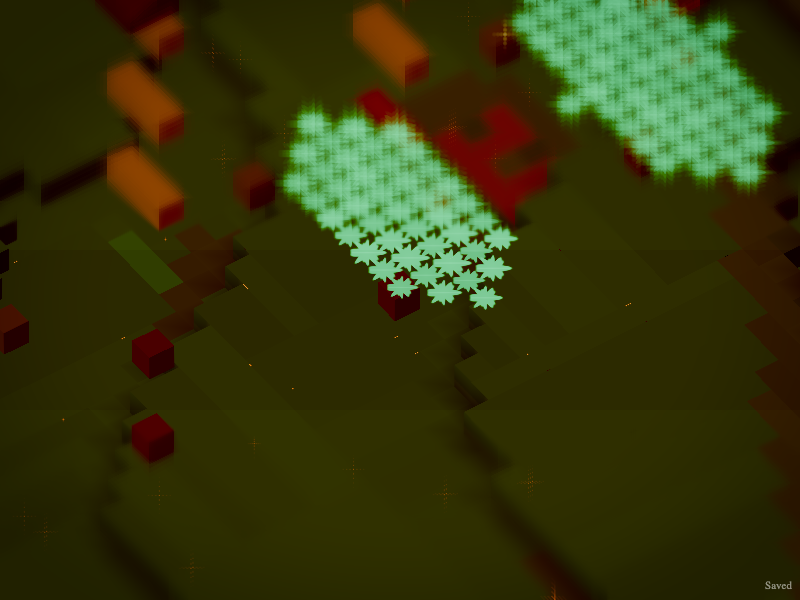

| Parameter | Value |
|-----------|-------|
| Max height | 0.05m (1 voxel) |
| Crown radius | 0.5m (10 voxels) |
| Growth rate | 1.0x |
| Water need | High |
| Shade tolerance | 20/255 (extreme) |
| Dispersal | 0.5m / 15 ticks |

**Niche:** First to colonize bare moist soil. Acid-tolerant. Part of the nitrogen handshake (groundcover near tree roots = 1.5x tree growth). Pioneer succession stage 1. Dense 87% leaf coverage creates a carpet effect.

### Grass (id: 10)
**Pioneer species #2 + soil binder.**

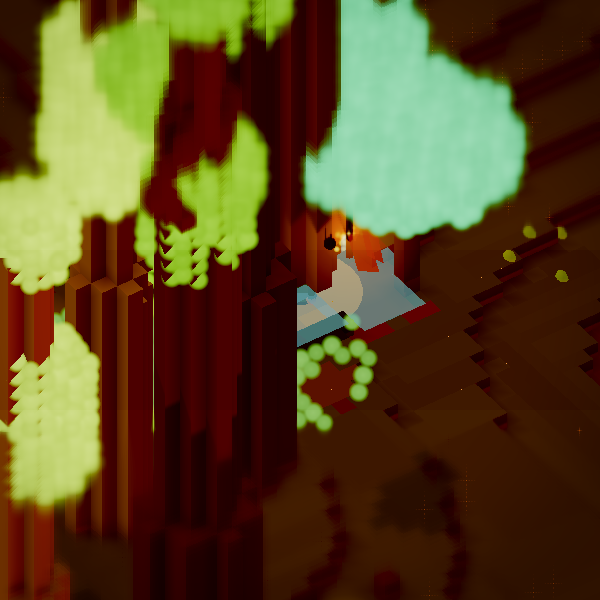 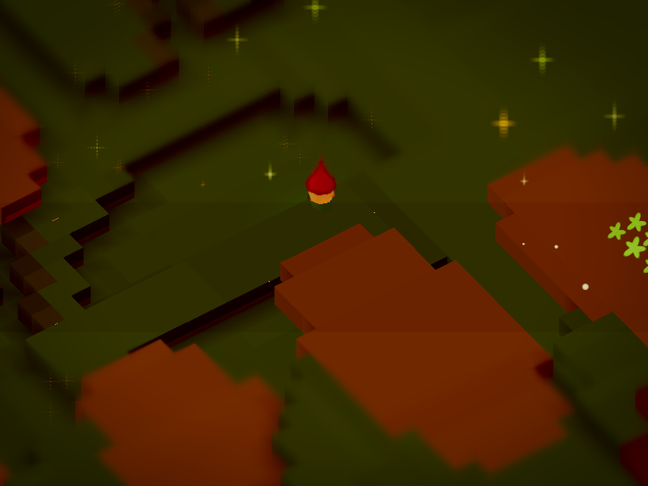 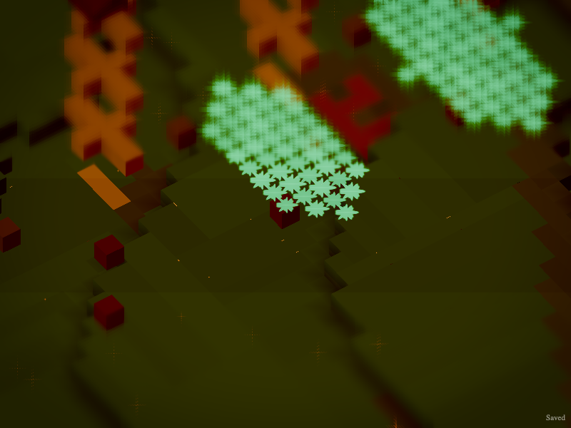

| Parameter | Value |
|-----------|-------|
| Max height | 0.1m (2 voxels) |
| Crown radius | 0.4m (8 voxels) |
| Growth rate | 2.0x |
| Water need | Low |
| Shade tolerance | 140/255 |
| Dispersal | 0.5m / 12 ticks |

**Niche:** Follows moss in succession. Roots increase soil clay content (+1/cycle), improving water retention. Fastest-dispersing groundcover. "Prepare the ground" strategy — plant grass before trees.

### Clover (id: 11)
**The nitrogen fixer.**

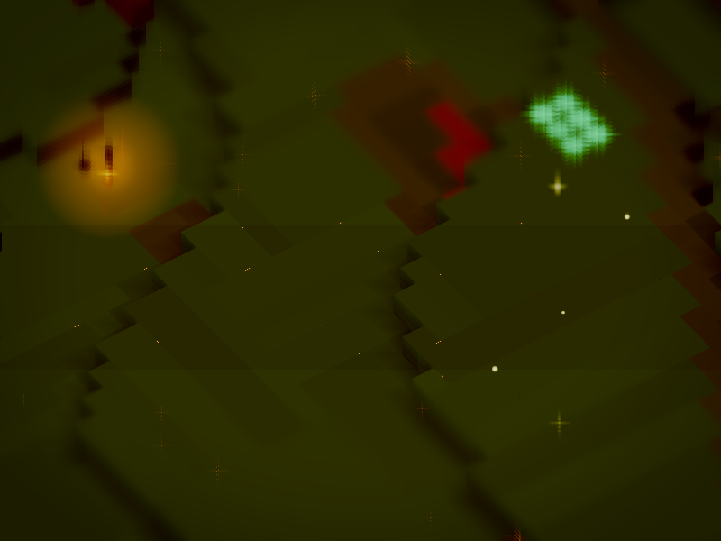 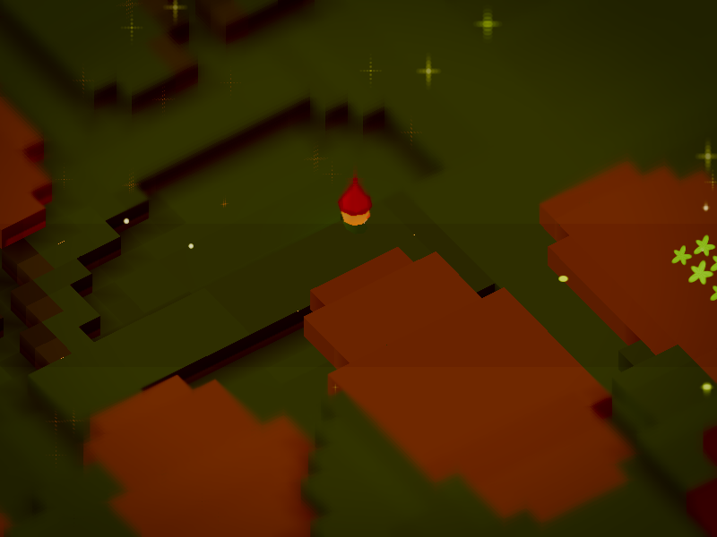 

| Parameter | Value |
|-----------|-------|
| Max height | 0.1m (2 voxels) |
| Crown radius | 0.4m (8 voxels) |
| Growth rate | 1.8x |
| Water need | Medium |
| Shade tolerance | 100/255 |
| Dispersal | 0.5m / 15 ticks |

**Niche:** Nitrogen handshake — clover near tree roots = 1.5x tree growth. Also binds soil like grass. The first "synergy" species the player discovers.

---

## Species Discovery

Players don't see all 12 species at the start. Species are **discovered** through ecological processes:

| Mechanism | Species Discovered |
|-----------|--------------------|
| Always available | Moss, Grass, Clover |
| Pioneer succession | Moss, Grass, Wildflower |
| Seed dispersal | Parent tree's species |
| Bird Express | Species of nearby tree |
| Squirrel acorn | Oak |
| Player planting | Whatever they plant |

Tier unlock (milestones gate which plant types are available):
- **Tier 0:** Groundcover (always)
- **Tier 1:** Flowers (after 10+ groundcover leaf voxels)
- **Tier 2:** Shrubs (after 2+ pollinators attracted)
- **Tier 3:** Trees (after 4+ fauna, 3+ species diversity)
